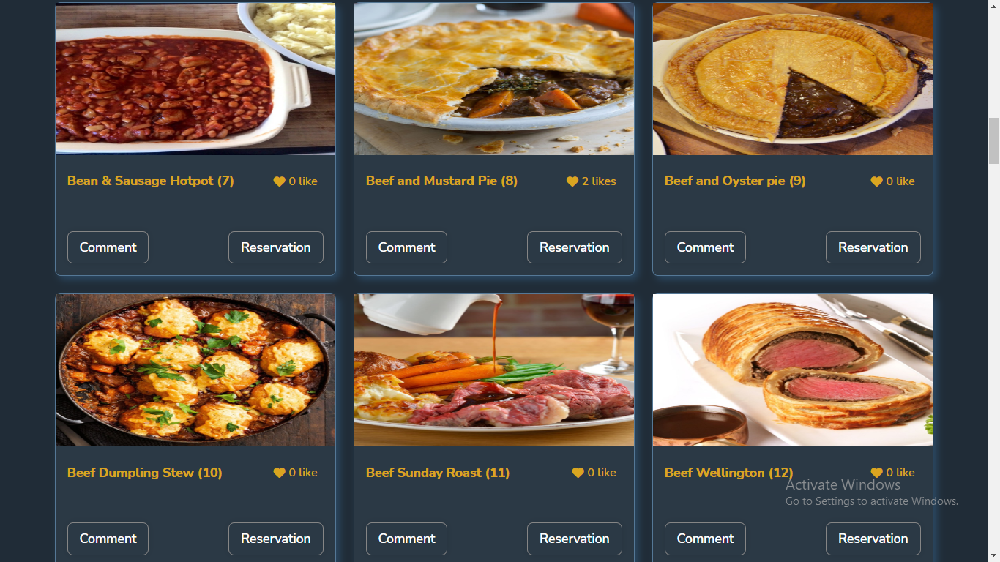

## Project Name 

E Meal
## The Meal DB

The Meal DB web application displays a list of meals that were provided by an external [API](https://www.themealdb.com/api/json/v1/1/filter.php?a=British). The users can like a meal, leave some comments or make a reservation, in these cases an involvement API was used [Involment API](https://www.notion.so/Involvement-API-869e60b5ad104603aa6db59e08150270).

## Project Objectives

Use JavaScript to make websites dynamic and build basic single page apps.
Use ES6 syntax.
Use ES6 modules.
Use callbacks and promises.
Use webpack.
Apply JavaScript best practices and language style guides in code.
Use AAA pattern for unit tests.
Write units tests for a JavaScript app.
Follow Gitflow.
Solve simple git conflicts.
Send and receive data from an API.
Use API documentation.
Understand and use JSON.
Make JavaScript code synchronous.

## Built With

- HTML
- CSS
- Javascript 
- Webpack
- API

## Project requirements 
Please find project requirements [here](https://github.com/microverseinc/curriculum-javascript/blob/main/group-capstone/js_capstone.md). 

## Screenshot

## How it works

The Meal DB web application allows users to like, comment, and make a reservation for their favorite meal.
* By clicking on `like button` the number of likes is increased and stored in the involvement API;
* By clicking on the `Comment button` to display the description of the selected meal, the list of all comments, and added a new comment;
* By clicking on the `Reservation button` to display the list of all reservations and make a new Reservation;

## Live Demo
[Live demo here](https://stephnna.github.io/e-meal/)

## Getting started
To get a local copy up and running follow these simple example steps:
## Prerequisites
- Have a good knowledge on how to parse UI designs
- Have VSCode or other text editor installed. [Link to download VSCode](https://code.visualstudio.com/download)
- Install node package. [Link to download node](https://nodejs.org/en/download/)
- Have git installed.[Link to download git](https://git-scm.com/downloads)
- Create a github repository.

## Setup
- `https://github.com/stephnna/e-meal.git`
- `cd e-meal/`
- Install packages:  `npm install`
- Start Live Server: `npm run dev`

-Follow the HTML-CSS linter confuguration to docs to setup linters [Link to Microverse linter docs](https://github.com/microverseinc/linters-config)

## Run tests

For tracking linters errors locally, you need to follow these steps:
- For tracking linter errors in HTML file run:

1. `npm install --save-dev hint@6.x`
2. `npx hint .`

- For tracking linter errors in CSS file run:

1. `npm install --save-dev stylelint@13.x stylelint-scss@3.x stylelint-config-standard@21.x stylelint-csstree-validator@1.x`
2. `npx stylelint "**/*.{css,scss}"`

- For tracking linter errors in Javascript file run:

1. `npm install --save-dev eslint@7.x eslint-config-airbnb-base@14.x eslint-plugin-import@2.x babel-eslint@10.x`
2. `npx eslint .`

- Consume the API
[Follow this Link](https://www.notion.so/Involvement-API-869e60b5ad104603aa6db59e08150270)

## 🤝 Contributing

Contributions, issues, and feature requests are welcome!
Feel free to check the [issues page](../../issues/).

## Show your support

Give a ⭐️ if you like this project!

## Acknowledgments

- Hat tip to anyone whose code and idea was used was used
- Inspiration
- etc

## 📝 License

This project is [MIT](./MIT.md) licensed.
